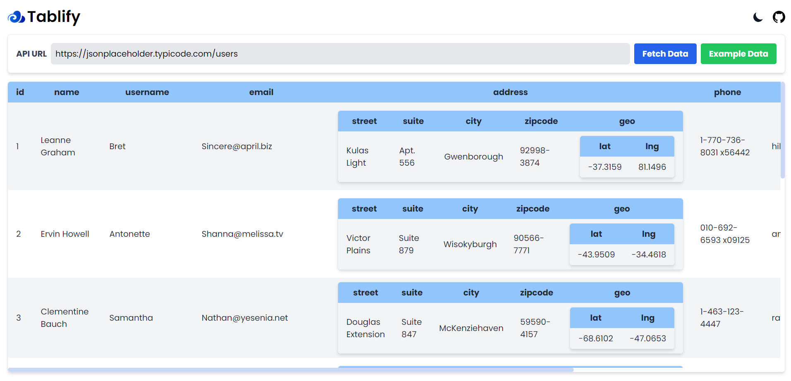
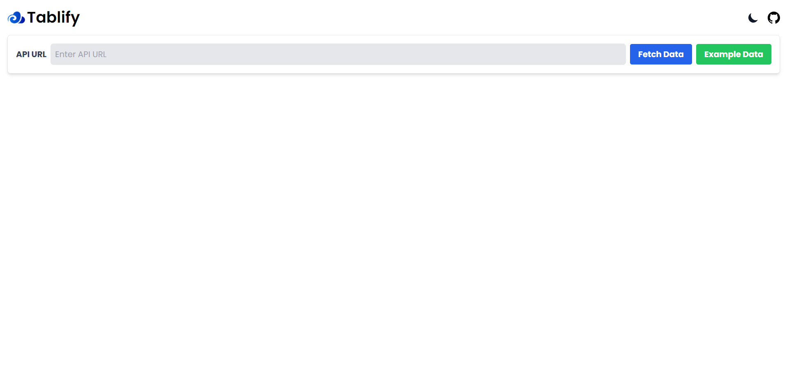

# Tablify

Tablify is a web application built with [Next.js](https://nextjs.org/) that allows users to fetch and display tabular data from an API URL. It provides a user-friendly interface to input the API URL, fetch data, and visualize it in a responsive table.

## Features

- **Dynamic Data Rendering:** Tablify dynamically renders tabular data based on the API response.
- **Recursive Table Display:** Supports nested objects and arrays of objects, displaying them recursively in the table.
- **Dark Mode:** Enjoy a dark mode for a comfortable viewing experience, especially in low-light environments.
- **Swipeable Table:** Easily navigate through horizontally overflowing tables on touch and mouse devices.

## Getting Started

```bash
# Clone the repository
git clone https://github.com/your-username/tablify.git
cd tablify

# Install dependencies
npm install
# or
yarn install
# or
pnpm install
# or
bun install

# Run the development server
npm run dev
# or
yarn dev
# or
pnpm dev
# or
bun dev
# Tablify
```
### Create .env file like in .env.example file
```
# create a environment variable for your Google Tracking Id
GA_TRACKING_ID=your-tracking-id-here
```

Open [http://localhost:3000](http://localhost:3000) with your browser to see the application.

## Usage

1. Enter the API URL in the input field.
2. Click the "Fetch Data" button to retrieve and display the tabular data.
3. Optionally, toggle between dark and light modes for a personalized viewing experience.
4. Navigate horizontally through the table using touch or mouse swipe gestures.

## Example Data

To quickly test the application, you can click the "Example Data" button, and the API URL will be set to [https://jsonplaceholder.typicode.com/users](https://jsonplaceholder.typicode.com/users).

## Contributing

Contributions are welcome! Feel free to open issues or submit pull requests to enhance the functionality or fix any bugs.

## License

This project is licensed under the MIT License.

## Deploy on Vercel

The easiest way to deploy your Tablify app is to use the Vercel Platform from the creators of Next.js.

Check out the [Next.js deployment documentation](https://nextjs.org/docs/deployment) for more details.

**Deployed Site:** [Deployment Website Link](https://tablify-data.vercel.app/)

<!-- 

 -->
